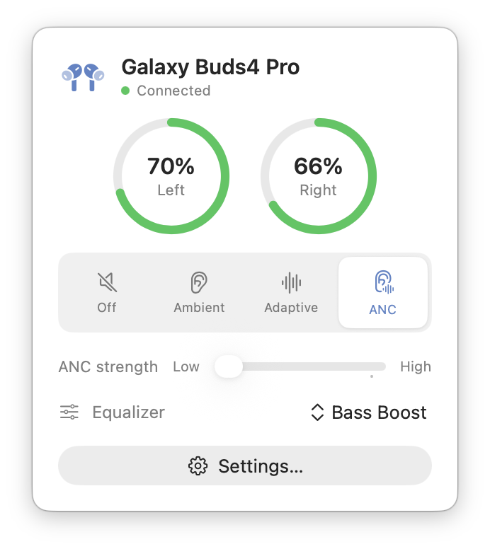
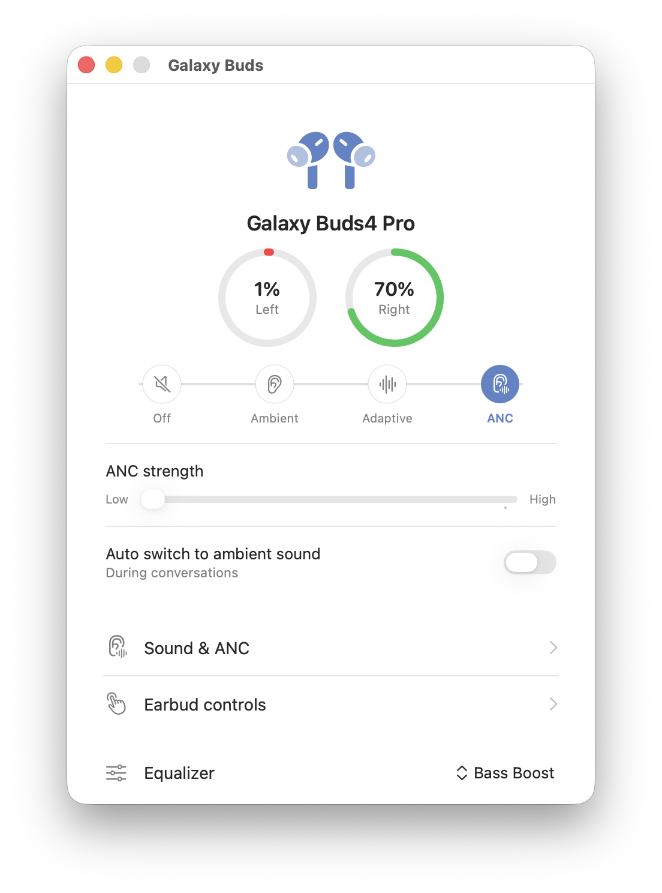
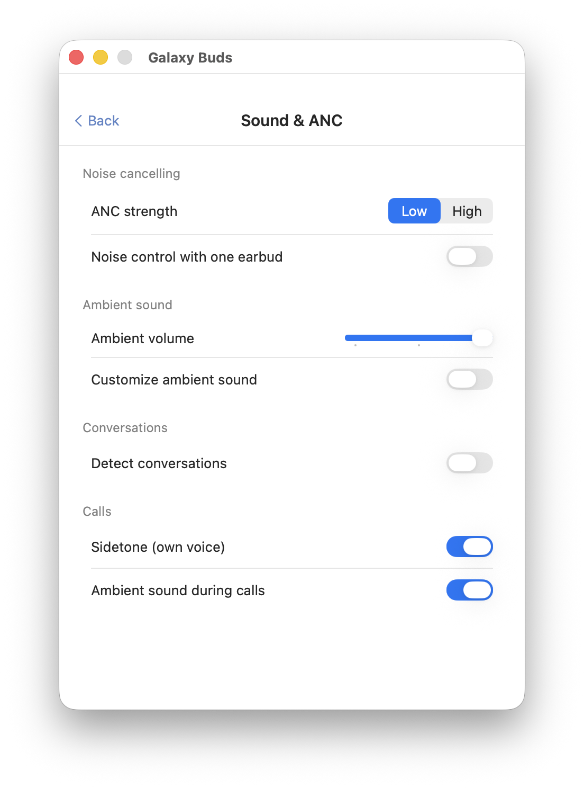
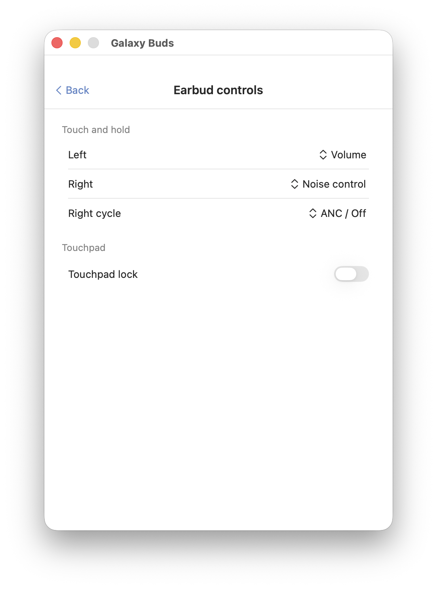

# Galaxy Buds for Mac

A lightweight, native macOS menu-bar app for Samsung Galaxy Buds. Connect over
Bluetooth and control noise cancellation, ambient sound, the equalizer, touch
gestures, find-my-earbuds, and more — without leaving your menu bar.

<p align="center">
  
</p>

> Unofficial. Not affiliated with or endorsed by Samsung. "Galaxy Buds" is a
> trademark of Samsung Electronics.

## Screenshots

| Menu bar quick panel | Settings |
|:---:|:---:|
|  |  |
| **Sound & ANC** | **Earbud controls** |
|  |  |

## Features

- **Menu-bar quick panel** — battery for each earbud, listen mode (Off /
  Ambient / Adaptive / ANC), ANC strength, and equalizer at a glance.
- **Sound & ANC** — ANC strength, ambient volume, custom ambient (per-side
  level + tone), detect conversations, sidetone, ambient during calls.
- **Earbud controls** — touch-and-hold action per side, noise-control cycle,
  touchpad lock.
- **Find My Earbuds** — ring both buds, mute one side while you search.
- **About / Diagnostics** — software version, serial numbers, earbud fit test.
- **Auto-connect** when the buds connect, and **Launch at login**.
- **Localized** in 11 languages — follows your Mac's language.

Supports Galaxy Buds through Buds4 Pro.

## Install

### Homebrew

```bash
brew tap vedatkilic/tap
brew trust vedatkilic/tap   # Homebrew requires trusting third-party taps once
brew install --cask vedatkilic/tap/galaxy-buds
```

### Manual

1. Download the latest `.dmg` from [Releases](https://github.com/vedatkilic/galaxy-buds-mac/releases).
2. Open it and drag **Galaxy Buds** into **Applications**.
3. Launch it. The earbud icon appears in your menu bar.

### First launch (unsigned app)

The app is open-source and not signed with an Apple Developer certificate, so
macOS Gatekeeper blocks it the first time. To allow it:

- **Right-click** the app → **Open** → **Open**, **or**
- **System Settings → Privacy & Security**, scroll to the message about
  "Galaxy Buds", and click **Open Anyway**.

You'll also be asked to allow **Bluetooth** access — required to talk to the
earbuds.

## Build from source

Requires **Swift 6 / Xcode Command Line Tools** on macOS 14+.

```bash
git clone https://github.com/vedatkilic/galaxy-buds-mac.git
cd galaxy-buds-mac
bash build.sh        # builds BudsApp.app (ad-hoc signed)
open BudsApp.app
```

Package a distributable disk image:

```bash
bash package.sh 1.0.0   # → dist/Galaxy-Buds-1.0.0.dmg
```

## How it works

The app speaks the Galaxy Buds SPP/RFCOMM control protocol directly over
`IOBluetooth`. All UI is SwiftUI; the menu-bar item and windows are AppKit. No
third-party dependencies.

## Privacy & transparency

- **Fully open-source** (MIT) — the entire codebase is in this repository.
- **No analytics, no tracking, no telemetry, no network calls.** The app only
  communicates with your earbuds over Bluetooth.
- **One permission:** Bluetooth, required to talk to the buds. Nothing else.
- **No account, no ads, no paid tiers** — it's free.
- Built by an independent developer; not affiliated with Samsung.

## License

[MIT](LICENSE)
